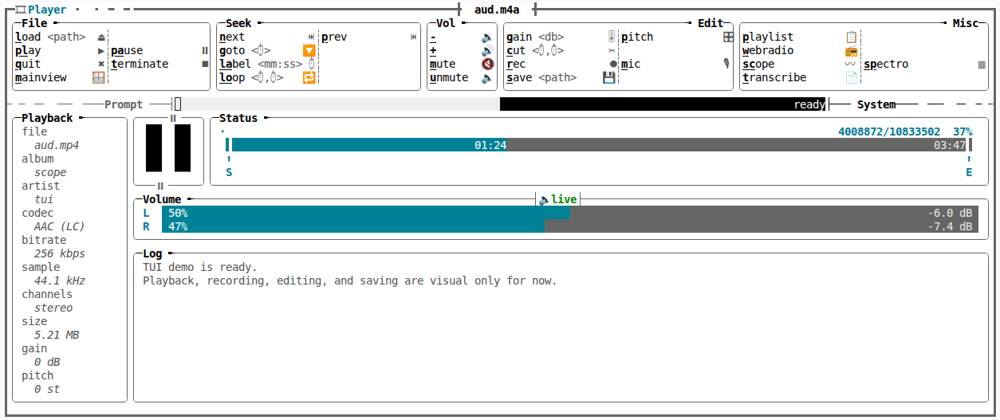

# player-scope

`player-scope` is a Ratatui UI-Only for an audio player interface. It focuses on
layout, command parsing, status feedback, playlist browsing, and scope-style
visual demos. Media playback, recording, saving, and transcription are
visual/logged flows only. Expect a finetuned rich Terminal UI where every command waits for you to wire
as your platform desires.



## Run

```sh
cargo run --example demo
```

## Command API

The `control` module is the integration surface for future backend logic:

- `parse_command` turns prompt text into a `ParsedCommand`.
- `dispatch` routes parsed commands into a `ControlEventHandler`.
- `COMMAND_SPECS` lists the supported commands and aliases.

The demo implements `ControlEventHandler` with visual behavior today. A real
backend can implement the same trait to connect playback, recording, saving,
playlist, and scope logic later.

## Local docs

This repository keeps generated Rust documentation in `doc/` for quick local
inspection:

```sh
cargo doc --no-deps --document-private-items
```
